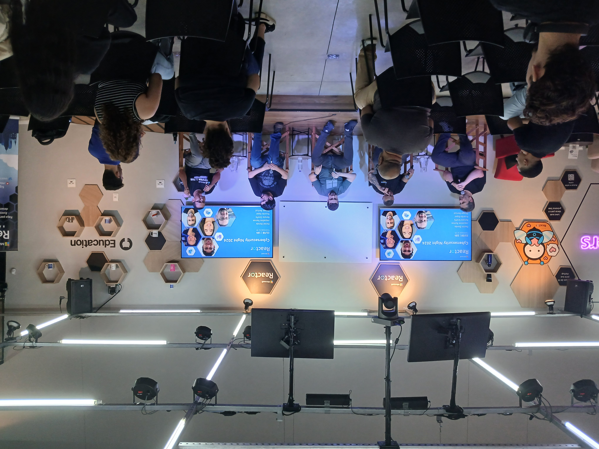
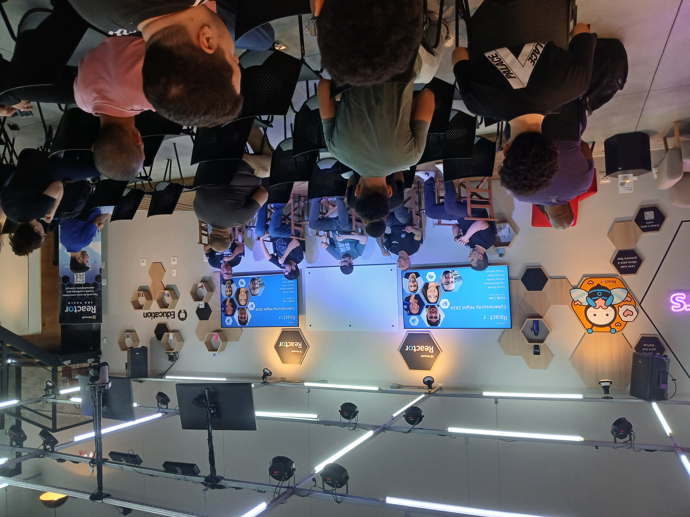
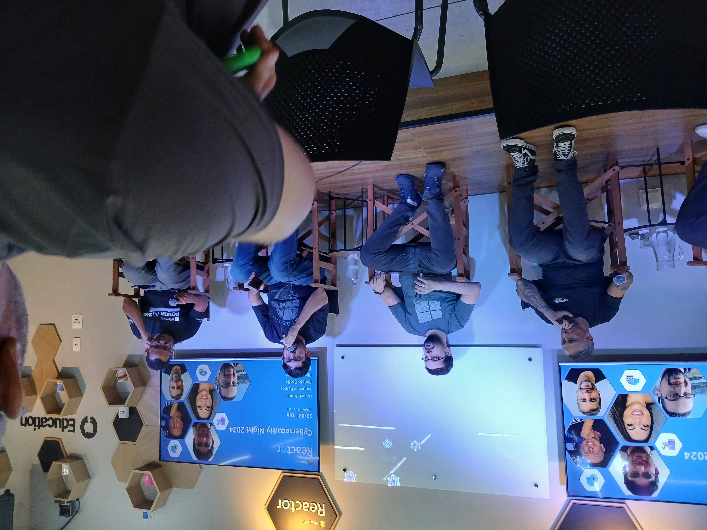
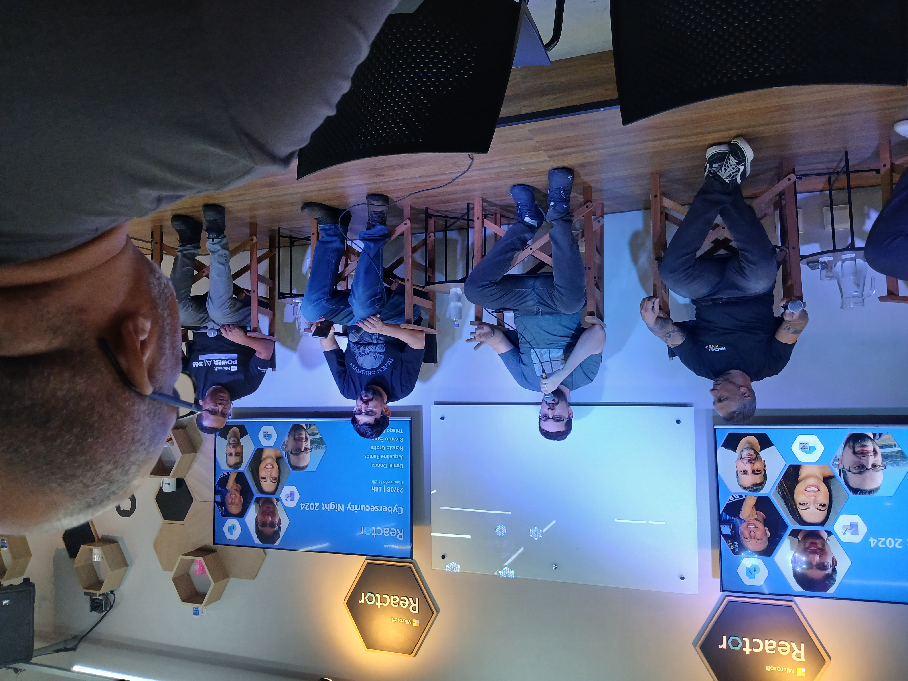
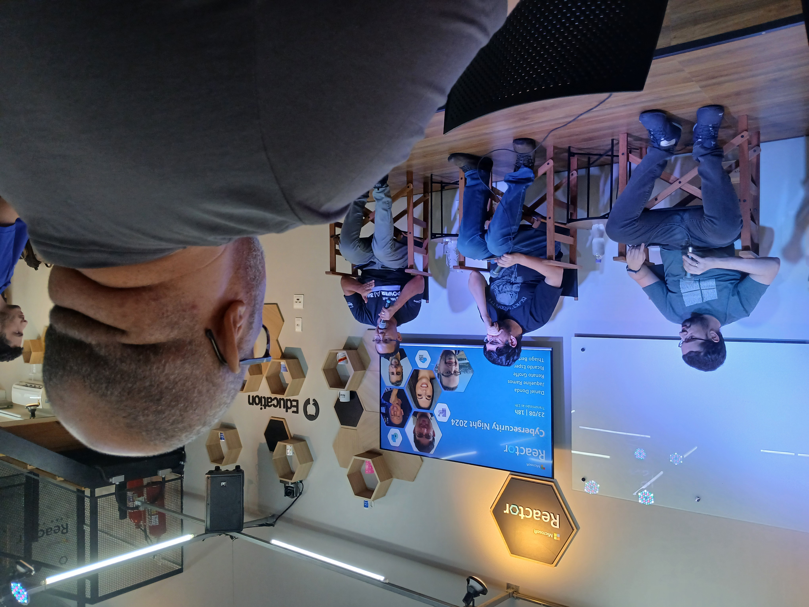
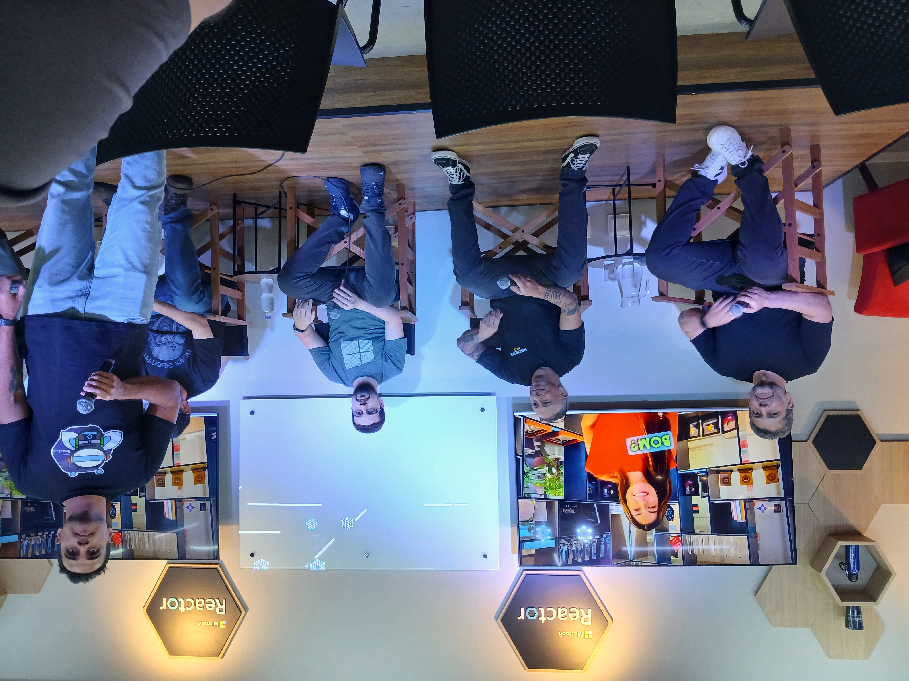
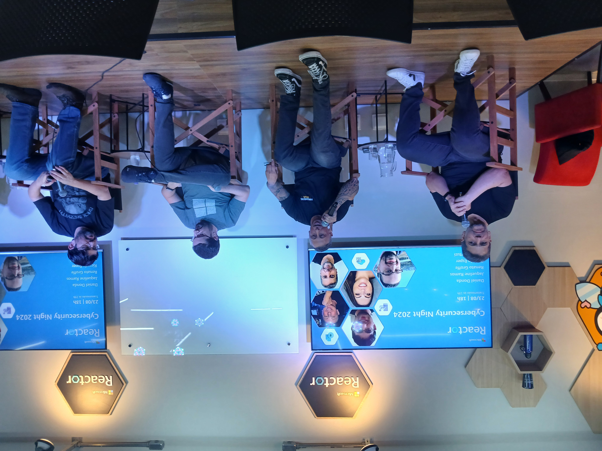
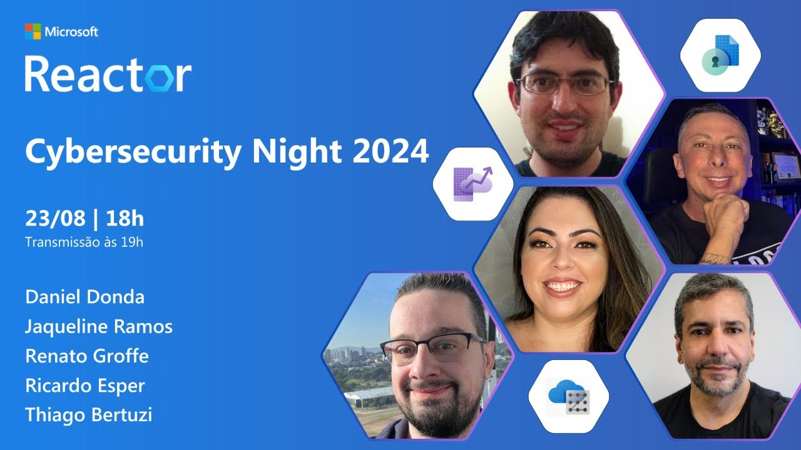

# Cybersecurity Night 2024
Fotos e informações gerais sobre o evento "Cybersecurity Night", realizado em 23/08/2024 na cidade de São Paulo-SP.

Organizadores:
- **Renato Groffe (Microsoft MVP, MTAC)**
- **Thiago Bertuzzi (Microsoft MVP)**

Número de participantes: **26 pessoas**

Painel que aconteceu durante o evento:
* **Segurança no mundo real: de boas práticas à resolução de incidentes!**

Participantes do Painel:
- Renato Groffe (Microsoft MVP, MTAC)
- Thiago Bertuzzi (Microsoft MVP)
- Daniel Donda (Microsoft MVP)
- Ricardo Esper (Founder & CEO da NESS)
- Johnson da Souza Cruz (Microsoft MVP, MTAC)

Tecnologias e tópicos abordados: **OWASP, Microsoft Azure, Azure API Management, Microsoft Entra ID, Azure Key Vault, Docker, Kubernetes .NET, ASP.NET Core, C#**

Acesse este [**link**](/img/) para visualizar todas as fotos das apresentações.

Link da transmissão: [**YouTube**](https://www.youtube.com/watch?v=HF9Ow7t67GM)

Este evento foi uma parceria entre a comunidade [**.NET SP**](https://www.meetup.com/dotnet-Sao-Paulo/) e o [**Microsoft Reactor**](https://www.meetup.com/Microsoft-Reactor-Sao-Paulo/).

Formulário utilizado para inscrições: [**Microsoft Reactor**](https://developer.microsoft.com/pt-br/reactor/events/23170/?wt.mc_id=3reg_23170_webpage_reactor)

Local: Microsoft Reactor - Rua Jaceru, 225 - Vila Gertrudes - São Paulo - SP - CEP: 04705-000

Deixamos aqui nossos agradecimentos ao Victor Temple e à Larissa Cyganski pela oportunidade e todo o apoio para promovermos esta edição local do .NET Conf no Microsoft Reactor em São Paulo-SP.

---

